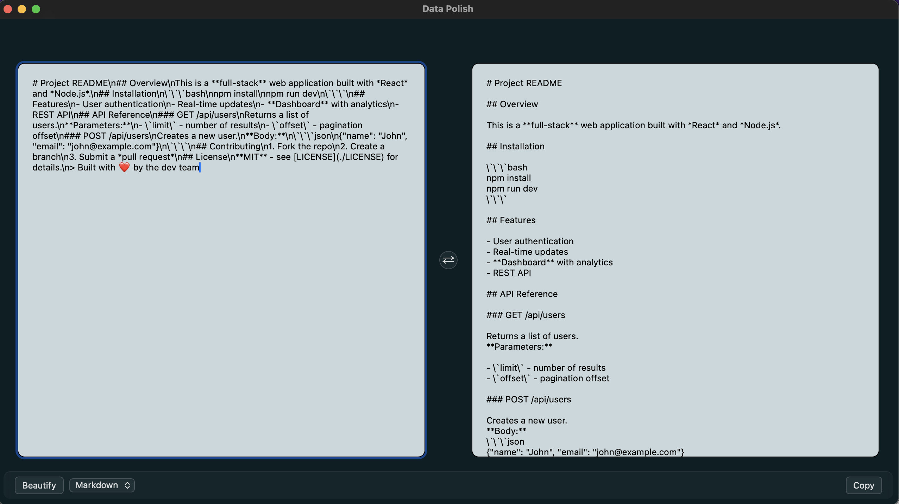

# Data Beautifier

A beautiful, snappy, and lightweight desktop app for formatting JSON, XML, YAML, and other data formats in Rust using the Tauri framework.

## Features

* Format JSON, XML, SQL, and other data formats with ease
* Customizable formatting options for each format
* Lightweight and snappy, fast and efficient
* Cross-platform support (Windows, MacOS, and Linux)

## Getting Started

To get started with Data Beautifier, follow these steps:

1. Install Rust using the official instructions from [here](https://www.rust-lang.org/tools/install).
2. Clone this repository or download the source code.
3. Run `cargo build` to compile the project.
4. Run `cargo run` to start the app.

## Usage

To use the Data Beautifier, simply open the app and drag and paste the data into the left hand windows. Then press Beautify, CMD+Enter, or Ctrl+Enter. The data will be beautified on the right hand side.

## Contributing

Contributions are welcome! I am always looking to add more file types/expand functionality. To contribute, please fork this repository and submit a pull request with your changes.

## License

Data Beautifier is licensed under the MIT license. See the `LICENSE` file for more information.
